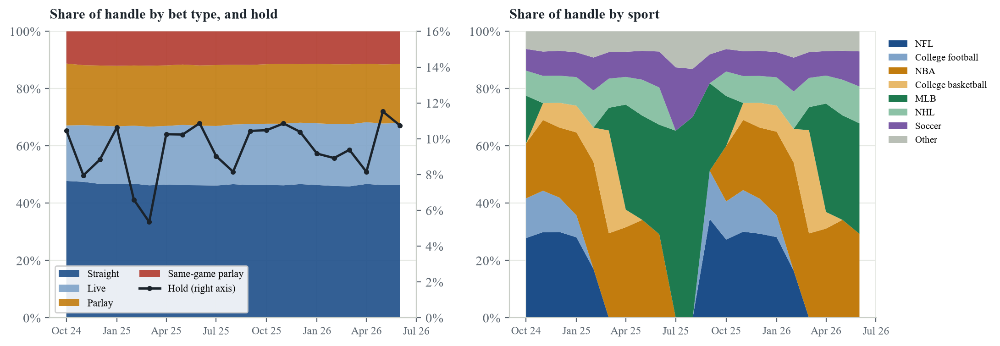
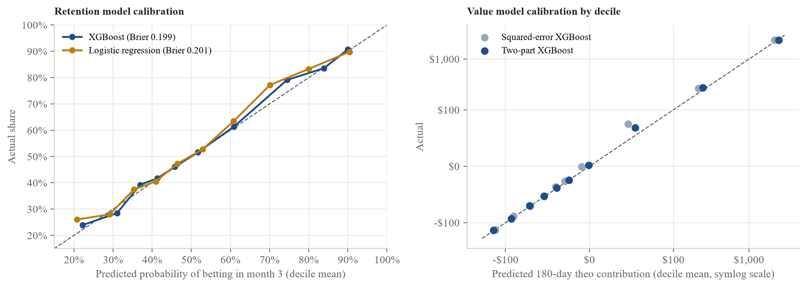
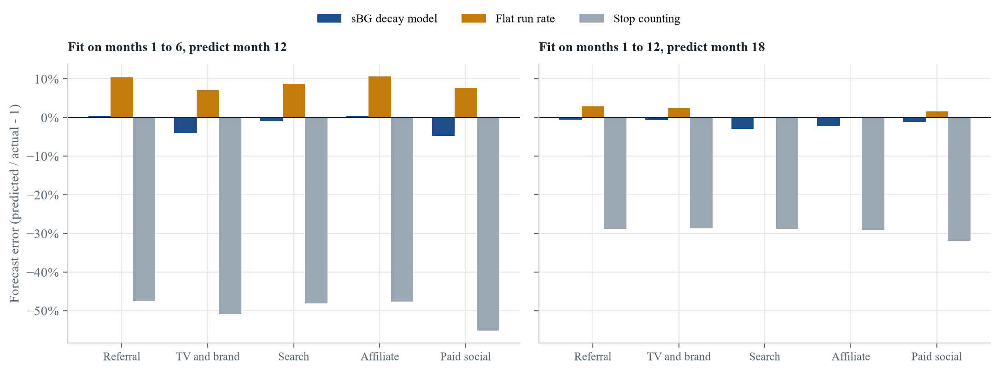
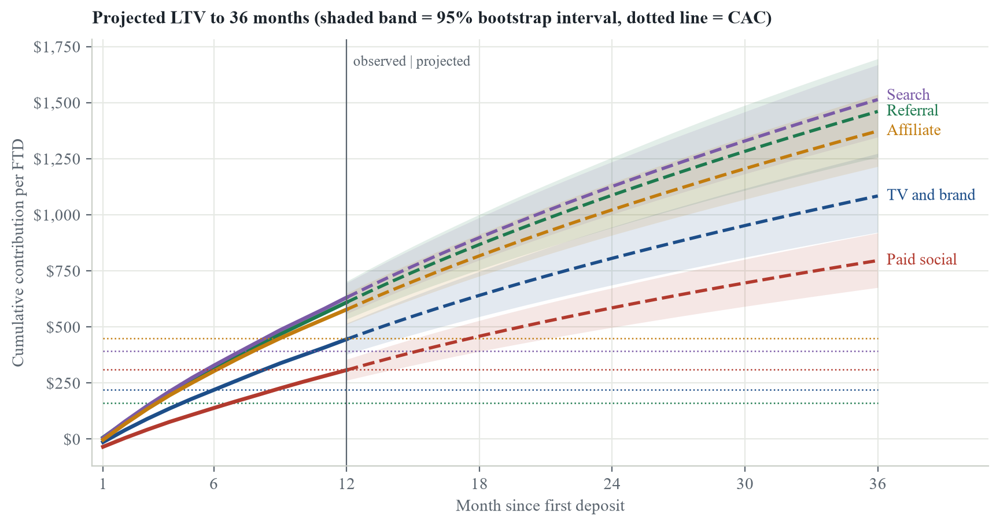
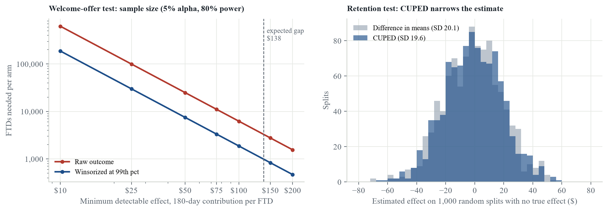

# Sportsbook Customer Economics

Robert Carrington · September 2026

Interactive dashboard: [robertcarrington22.github.io/sportsbook-customer-economics/](https://robertcarrington22.github.io/sportsbook-customer-economics/)

## Abstract

This report estimates what a sportsbook's first-time depositors (FTDs) cost to acquire, what they contribute, and how early their value can be predicted. The data is a simulation of 40,000 FTDs and 6,685,874 individual bets, with seasonality, hold, and hold volatility calibrated to DraftKings' public monthly filings in New York. Year-one contribution averages $485 per FTD against a blended CAC of $323, a 1.50× return, but value is highly concentrated: the top 1% of FTDs produce 53% of it and 70% are net negative at day 180. Channel, welcome offer, state tax, and early gameplay each move value materially; players who bet three or more sports in their first two weeks are 2.0× as likely to still be betting in month 3 as single-sport players. Valuing players on theoretical rather than realized win removes bet-outcome luck, and on that basis a two-part XGBoost model ranks 180-day value at 0.89 Spearman from day-14 data, within 3% of the actual average. A retention-decay model, backtested within 2% of 12-month value, projects 36-month returns of 2.6× to 9.1× CAC. The report sizes the experiments its recommendations need, and ships the scoring as a daily job with drift monitoring. A separate section tests TabPFN, a pretrained tabular foundation model: with 3,000 training players and no tuning, it ranks value at 0.89 Spearman, matching the best XGBoost model trained on 33,246.

I built this for the Analyst I, Customer Economics role at DraftKings. None of it uses DraftKings internal data, and where a result follows directly from an assumption rather than from the analysis, I say so.

| Headline | Value |
|:---|---:|
| Simulated FTDs | 40,000 |
| Blended CAC | $323 |
| 12-month contribution per FTD | $485 |
| 12-month LTV / CAC | 1.50× |
| Share of FTDs net negative at day 180 | 70% |
| Share of year-one contribution from the top 1% | 53% |
| Value model rank correlation (theo, day 14) | 0.89 |

## Contents

1. [Objective](#1-objective)
2. [Data collection](#2-data-collection)
3. [Data cleaning and transformation](#3-data-cleaning-and-transformation)
4. [Exploratory data analysis](#4-exploratory-data-analysis)
5. [Feature engineering](#5-feature-engineering)
6. [Modeling choices](#6-modeling-choices)
7. [Findings](#7-findings)
8. [Test design for the recommended changes](#8-test-design-for-the-recommended-changes)
9. [From analysis to production](#9-from-analysis-to-production)
10. [Conclusion](#10-conclusion)
11. [TabPFN: process and comparison](#11-tabpfn-process-and-comparison)
12. [Reproducibility](#12-reproducibility)

## 1. Objective

A customer economics team decides how much to pay for a new customer and where to spend to keep them. This analysis answers five questions:

1. What is a first-time depositor worth over 12 months, after promos, tax, and variable cost, and beyond?
2. How do acquisition channel, welcome offer, and state change that value and the payback period?
3. How do retention and gameplay evolve, and what does early gameplay say about a player?
4. How well can a player's value be predicted from their first 14 days, and which model should do it?
5. What experiments and systems would it take to act on the answers?

## 2. Data collection

### 2.1 Real data: DraftKings' New York filings

The New York State Gaming Commission publishes each mobile sports operator's monthly handle (total amount wagered) and gross gaming revenue (GGR, the amount the book keeps). I downloaded DraftKings' report, a PDF covering January 2022 through August 2026, 56 months in all. Over the last 12 months DraftKings took $9.28B in New York handle at a 9.3% hold, and New York taxes GGR at 51%.


### 2.2 Simulated player-level data

No public dataset has sportsbook customers with acquisition channel, CAC, and promo cost, which is the core of customer economics. The one academic dataset of real bettors (the Transparency Project's bwin data) is licensed for non-commercial research only. So I simulated the player level, and used the real filings to calibrate it.

`simulate.py` generates 40,000 FTDs who signed up between September 2024 and August 2025 and every bet they placed through June 2026: 6,685,874 bets on 1,584,823 player-days. Each FTD has:

- an acquisition channel (referral, TV and brand, search, affiliate, paid social), each with its own CAC
- a welcome offer (no-sweat first bet, deposit match, or bet $5 get $200), each with its own expected cost
- a state (nine, each with its tax rate)
- a bet-type mix (straight, live, parlay, same-game parlay) and sport preferences (NFL, college football, NBA, college basketball, MLB, NHL, soccer, other), drawn around their player type's typical mix
- a hidden player type (bonus hunter, casual, regular, high value) that sets churn, betting frequency, stake size, and how much of the welcome offer the player extracts

Each bet gets a bet type from the player's mix and a sport weighted by the player's preferences and that sport's real season calendar. Players bet more in the months their sports are in season, so a football-only bettor goes quiet after the Super Bowl. Channels and offers shift the mix of player types, which is the main assumption behind channel and offer results. The analysis never sees player type. It works only from behavior, as it would on real data. Type is used once, at the end, to check whether the models find the right players.

**What is calibrated to real data, and how close the simulation lands:**

| Measure | DraftKings NY (real) | Simulation |
|:---|---:|---:|
| Hold, Sep 2024 onward | 9.1% | 9.5% |
| Monthly hold, standard deviation | 1.64 pts | 1.58 pts |
| Seasonality of activity by calendar month | Index (2.1) | correlation 0.97 with the real index |
| New York tax rate | 51% of GGR | 51% |

Hold is set by the bet-type mix, since parlays hold far more than straight bets (section 4.5). Hold also swings month to month because every customer bets on the same games, so outcomes are correlated. Bet outcomes alone produce part of that swing; one shared shock per month supplies the rest, sized so the total matches the real standard deviation. The seasonality check compares each calendar month's betting rate among retained players with the real index. Channel CACs, offer costs, bet-type mixes, player-type behavior, and the non-New York tax rates are my assumptions, all listed in `assumptions.toml`.

## 3. Data cleaning and transformation

### 3.1 Regulator filings

- Extracted the monthly rows from each page of the PDF with `pdfplumber` and a regular expression, then dropped the pre-launch months reported as $0.
- De-duplicated months that appear on more than one fiscal-year page.
- Computed hold as GGR divided by handle, and checked the state's share of GGR against the statutory 51% (it matches to three decimals every month).
- Removed market growth before measuring seasonality: each month's handle was divided by a centered 12-month moving average, and the ratios were averaged by calendar month and scaled to a mean of 1.

### 3.2 Player data

All transformation is in SQL (DuckDB), in `sql/01` through `sql/19`. Bets roll up to player-days, and player-days to a **player-month panel**: one row per FTD per 30-day "life month" since first deposit, 686,051 rows in all. Three decisions shape it:

- **Zero months are kept.** A month with no bets is a row with zeros, not a missing row. Averages are per FTD, not per active player, so retention and value are not overstated.
- **Right censoring is handled by truncation.** Each player is cut at their last fully observed month. Any 12-month figure uses only players with 12 full months, which is 36,457 of the 40,000 FTDs. Younger cohorts never pull a curve down.
- **Life months, not calendar months.** Month 1 is each player's first 30 days, so cohorts that signed up at different times are compared at the same age.

**Contribution** is the value measure throughout, in two versions:

```
contribution      = GGR  - welcome promo - ongoing promos - tax x (GGR  - promos) - 0.6% x handle
theo contribution = theo - welcome promo - ongoing promos - tax x (theo - promos) - 0.6% x handle
theo              = sum over bets of stake x the book's expected hold for that bet type
```

Contribution uses realized GGR: what the book actually won, including luck. Theo contribution uses theoretical win: what the book expects to win given what and how the player bets. Both are contribution margins, not profit: they exclude fixed costs and overhead. Tax is applied to GGR net of promos as a simplification (section 10.3). Historical results in this report use realized contribution; predictions and projections use theo, for the reasons in 7.1.

## 4. Exploratory data analysis

### 4.1 Where revenue goes


Of $1,073 in year-one GGR per FTD, promos take $317 (30%) and tax $203. Contribution is $485, 45% of GGR.

### 4.2 The distribution of player value


| Mean | Median | 10th pct | 25th pct | 75th pct | 90th pct | 99th pct | Skewness |
|---:|---:|---:|---:|---:|---:|---:|---:|
| $218 | -$53 | -$191 | -$110 | $39 | $502 | $6,667 | 13.6 |

180-day contribution is extremely right-skewed. The mean is $218 while the median is -$53, and 70% of FTDs are below zero, mostly because the welcome offer costs more than the book ever wins back from them. This shapes every later choice: averages are fragile, so channel results get bootstrap intervals, and model evaluation leans on rank-based metrics rather than squared error.


| Players | Share of year-one contribution | Average contribution |
|:---|---:|---:|
| Top 1% | 53% | $25,835 |
| Top 5% | 96% | $9,273 |
| Top 10% | 111% | $5,355 |
| Top 20% | 119% | $2,894 |

The top 6% of players account for all year-one contribution. The share passes 100% because the rest are net negative in aggregate.

### 4.3 Retention


On average 39% of FTDs place no bet in their second month and 24% are still betting in month 12. Seasonality shows up in the second month: 64% of September 2024 signups bet again, against 55% of June 2025 signups.


FTDs who sign up between September and January are worth $213 over six months, against $220 for February through July signups, whose early months overlap the summer lull.

### 4.4 Early handle against later value

| Handle, days 0 to 13 | Share of FTDs | Avg active days | Active month 3 | Mean 180-day contribution | Share profitable | Share of total 180-day |
|:---|---:|---:|---:|---:|---:|---:|
| under $50 | 44.8% | 1.7 | 38% | -$73 | 8% | -15% |
| $50 to $250 | 29.0% | 2.8 | 57% | -$25 | 33% | -3% |
| $250 to $1k | 15.1% | 4.4 | 80% | $160 | 60% | 11% |
| $1k to $5k | 8.0% | 6.1 | 89% | $972 | 73% | 36% |
| $5k and up | 3.1% | 7.7 | 92% | $5,042 | 77% | 72% |

Early handle separates players sharply. The 3.1% of FTDs who stake $5,000 or more in their first two weeks produce 72% of 180-day contribution. This is the baseline any model has to beat.

### 4.5 Gameplay: bet types and sports



| Bet type | Share of handle | Share of bets | Hold | Share of GGR |
|:---|---:|---:|---:|---:|
| Straight | 46% | 38% | 5.0% | 25% |
| Live | 21% | 19% | 5.4% | 12% |
| Parlay | 21% | 25% | 16.2% | 36% |
| Same-game parlay | 12% | 18% | 22.6% | 28% |

Parlays and same-game parlays are 33% of handle but 63% of GGR, because they hold three to four times as much as straight bets. That mix is the main driver of a book's hold. Sport mix follows the calendar: football dominates the fall, basketball the winter and spring, and baseball the summer.

What a player bets in their first two weeks says a lot about what comes next. The last column follows fall signups (September to December 2024) into the following offseason, March to August 2025:

| First 14 days | FTDs | Avg handle | Active month 3 | Mean 180-day contribution | Fall signups still betting in offseason |
|:---|---:|---:|---:|---:|---:|
| Football share of handle: football-heavy (80%+) | 7,158 | $93 | 44% | -$45 | 34% |
| Football share of handle: mixed (40% to 80%) | 10,798 | $833 | 62% | $266 | 53% |
| Football share of handle: mostly other sports | 22,044 | $814 | 56% | $280 | 50% |
| Parlay share of handle: under 25% | 12,046 | $755 | 45% | $173 | 36% |
| Parlay share of handle: 25% to 50% | 10,537 | $1,337 | 69% | $525 | 59% |
| Parlay share of handle: 50% to 75% | 7,282 | $500 | 64% | $189 | 55% |
| Parlay share of handle: 75% and up | 10,135 | $78 | 47% | -$26 | 40% |
| Sports bet in first 14 days: one sport | 7,898 | $28 | 35% | -$68 | 28% |
| Sports bet in first 14 days: two sports | 9,988 | $68 | 41% | -$47 | 33% |
| Sports bet in first 14 days: three or more | 22,114 | $1,208 | 69% | $440 | 58% |

- **Breadth is the strongest gameplay signal.** Players who bet three or more sports in their first 14 days retain at 69% into month 3, against 35% for single-sport players, and are worth $440 against -$68. Part of this is volume, since players who bet more touch more sports, which is why the model includes both.
- **Football-only players fade in the offseason.** Among fall signups, 34% of football-heavy players are still betting between March and August, against 53% of those with a mixed sport diet. That points to a concrete marketing action: cross-sell basketball and baseball to football-heavy players before the Super Bowl, while they are still engaged.
- **Parlay share has a sweet spot.** Players with 25% to 50% of handle in parlays are worth the most ($525), while those at 75% and up are small, short-lived, and net negative (-$26). Heavy parlay bettors hold well per dollar but bet few dollars.
- These relationships come partly from my assumptions (casual types lean toward NFL and parlays). The analysis shows how to measure them; the sizes on real data could differ.

## 5. Feature engineering

The prediction point is **day 14**: a model scores each FTD using only what is known by the end of their 14th day (days 0 to 13). Features are built in `sql/08_early_features.sql`.

**Targets**

- `active_m3`: whether the player bets at all in life month 3 (days 60 to 89). Binary, 55% positive.
- `theo_contribution_180`: theoretical contribution over days 0 to 179, the primary value target (section 7.1 explains why theo rather than realized). It includes the first 14 days by design, because the business question is the player's total value; the model's real work is the remaining 166 days.
- `contribution_180`: realized contribution over the same window, kept for comparison.

**Features**, with their rank correlation to each target

| Feature | Spearman with 180-day theo value | Spearman with active in month 3 |
|:---|---:|---:|
| Handle (total staked) | 0.71 | 0.39 |
| Largest single-day handle | 0.70 | 0.36 |
| Average stake per bet | 0.60 | 0.26 |
| Bets placed | 0.63 | 0.41 |
| Active days, days 0 to 13 | 0.50 | 0.34 |
| Active days, days 7 to 13 | 0.46 | 0.32 |
| Days since last bet, at day 13 | -0.42 | -0.31 |
| GGR (book's realized win) | 0.19 | 0.10 |
| Parlay and same-game-parlay share of handle | 0.10 | 0.05 |
| Live-bet share of handle | 0.36 | 0.23 |
| Number of sports bet | 0.54 | 0.36 |
| Football share of handle | -0.01 | -0.01 |
| Calendar ahead, days 14 to 179 (NY index) | 0.02 | 0.02 |
| Calendar ahead, month 3 (NY index) | 0.02 | 0.02 |
| Welcome offer cost | -0.39 | -0.03 |

- Categorical context: acquisition channel, welcome offer, state, and signup month.
- Week 2 activity and days idle capture the *trend* of engagement: a player who bet heavily on day 1 and then stopped differs from one still betting on day 13.
- Largest single-day handle sits alongside total handle because a few large days signal a high-stakes player differently from many small ones.
- Gameplay features (parlay share, live share, number of sports, football share) come from the bet-level table and describe *how* a player bets, not just how much.
- **Calendar-ahead features** average DraftKings' real New York seasonality index over the player's outcome window. They depend only on the signup date, so they are known at day 14 and are not leakage. They exist because of the out-of-time split: the model trains on September to April signups and is tested on May to August, so signup month alone gives it nothing for summer cohorts. A continuous measure of how busy the calendar ahead is generalizes where signup month cannot.
- **Leakage check:** no feature uses anything after day 13, and nothing downstream of the outcome (such as churn date or lifetime) is available to the model.

Transformations depend on the model. For logistic regression, numeric features get a signed log transform, `sign(x) * log(1 + |x|)`, to tame the heavy tails (GGR can be negative), then standardization, and categoricals are one-hot encoded. XGBoost takes raw values and native categorical splits, since trees are invariant to monotone transforms.

## 6. Modeling choices

- **Out-of-time split.** Train on Sep 2024 to Apr 2025 signups (33,246 players), test on May 2025 to Aug 2025 (6,754). A random split would leak seasonal information across the boundary, and in practice the model is fit on past cohorts and used on new ones.
- **Baselines first.** Logistic regression for retention, and two naive rules for value: sort by 14-day handle, and predict the training mean.
- **XGBoost** as the main model: histogram trees with native categorical splits, which handle missing values, categoricals, and interactions without manual work. Settings: learning rate 0.03, max depth 6, minimum child weight 5, row and column subsampling of 0.8, and early stopping after 100 rounds without improvement on a held-out 10% of the training rows, so the number of trees is chosen by validation.
- **Theo as the value target.** Value models predict theoretical contribution. Realized contribution is reported alongside, and section 7.1 shows the difference.
- **A two-part value model**, because value is heavy-tailed and often negative. One XGBoost classifier estimates the chance a player ends up profitable. A second predicts log(1 + value) for profitable players, converted back to dollars with Duan's smearing correction estimated on held-out rows. A third predicts the size of the loss for unprofitable players. Expected value is p × E[value | profitable] + (1 − p) × E[value | not profitable]. A plain squared-error XGBoost is kept as a comparison.
- **Metrics chosen for the skew.** AUC for retention. For value, Spearman rank correlation and top-decile lift, because the business action is ranking players and a few whales dominate any squared-error metric. Mean absolute error and calibration (predicted against actual by decile) are reported because bids are set in dollars.
- **Permutation importance** on the test set: how much accuracy drops when a feature is shuffled.
- **Bootstrap intervals** for channel LTV/CAC: 2,000 resamples of players within each channel.
- **Lifetime value beyond the observed window** with a shifted-beta-geometric (sBG) retention curve per channel: the share of FTDs still betting in month t is S(t) = B(a, b + t) / B(a, b), which allows churn to differ across players and gives the long, slow-decaying tail a single churn rate cannot. Projected theo contribution is S(t) times the theo value of an active player (the average of the last three observed months), backtested twice on held-out months, with bootstrap intervals.
- **Test design**: sample size per arm at 5% significance and 80% power, winsorizing at the 99th percentile, and CUPED or regression adjustment on pre-treatment covariates.

## 7. Findings

### 7.1 Model performance


| Question | Metric | Model | Baseline |
|:---|:---|---:|:---|
| Bets in month 3? | AUC | 0.754 (XGBoost) | 0.752 (logistic regression) |
| Flag the at-risk decile | Share who lapse | 76% | 45% (all players) |
| Rank by 180-day theo value | Spearman | 0.886 | 0.687 (sort by 14-day handle) |
| Find the top decile | Lift over average | 10.31× | 10.30× (sort by 14-day handle) |
| Predict dollar value | Mean absolute error | $152 | $478 (predict the mean) |
| Find hidden high-value players | Share of top decile | 72% | 10% (base rate) |

- On retention, XGBoost and logistic regression are close (0.754 and 0.752 AUC); XGBoost is better calibrated (below).
- On value, the two-part model ranks the whole base far better than early handle alone (0.89 vs 0.69) and is well calibrated: it predicts an average of $236 against an actual $229, and $2,484 for its top decile against an actual $2,365.
- 72% of the model's top decile are truly high-value players, against a 10% base rate, which confirms it finds the right people rather than fitting noise. Handle, stake size, and parlay share carry most of the signal.

**Why theo, not realized value.** The first version of this model predicted realized contribution, and it under-predicted the test cohorts badly. The reason is luck. Over the 166 days being predicted, bettors in the training cohorts happened to win more than the book expected, and the test cohorts did not:

| Days 14 to 179 | Realized hold | Expected hold, given their bets | Book's luck |
|:---|---:|---:|---:|
| Training cohorts | 8.82% | 9.47% | -0.65 pts |
| Test cohorts | 9.42% | 9.29% | +0.13 pts |

A model trained on realized value learns the training cohorts' bad luck as if it were player behavior. Because contribution is only about half of GGR, a point of hold luck moves contribution by roughly twice as much in percentage terms. Sportsbooks value players on theoretical win for exactly this reason. Swapping the target changes the picture:

| Value model | Spearman vs theo | Top decile, predicted ÷ actual | Mean prediction (actual $229) |
|:---|---:|---:|---:|
| Squared-error XGBoost, realized target | 0.771 | 0.80 | $178 |
| Squared-error XGBoost, theo target | 0.872 | 0.93 | $203 |
| Two-part XGBoost, theo target | 0.886 | 1.05 | $236 |

Scored against realized outcomes instead, every model's ranking drops (the two-part model to 0.50, early handle to 0.35), because six months of realized results for an individual player are dominated by whether their bets won. Realized and theo 180-day value correlate at only 0.69 across players. That noise is real money, but no behavioral model can predict it, so it belongs in the error bars, not in the model.



**Calibration.** Both retention models beat the base rate on Brier score (0.199 for XGBoost, 0.201 for logistic regression, 0.248 for predicting the training average). XGBoost's lowest decile predicts 22% and sees 24%; its highest predicts 90% and sees 91%. On value, the two-part model's deciles sit on the diagonal, while the squared-error model's sit below it at the top.

### 7.2 Channel economics


| Channel | FTDs | CAC | 12-mo LTV | Median LTV | LTV / CAC | 95% interval | Active month 3 | Payback |
|:---|---:|---:|---:|---:|---:|---:|---:|---:|
| Referral | 4,379 | $160 | $577 | -$33 | 3.61× | 3.02 to 4.36 | 62% | month 4 |
| TV and brand | 6,551 | $220 | $445 | -$42 | 2.02× | 1.64 to 2.47 | 57% | month 7 |
| Search | 7,287 | $391 | $622 | -$39 | 1.59× | 1.36 to 1.82 | 60% | month 8 |
| Affiliate | 8,101 | $450 | $584 | -$56 | 1.30× | 1.12 to 1.49 | 52% | month 10 |
| Paid social | 10,139 | $310 | $293 | -$55 | 0.95× | 0.76 to 1.16 | 50% | none in 12 mo |

The interval for paid social reaches below 1.0×, so its year-one return is not certain. The median FTD is net negative in every channel. Channels differ in how many high-value players they bring, not in how the typical player behaves. These are realized results: what actually happened, luck included.

### 7.3 Channel and offer


| Offer | FTDs | Offer cost per FTD | Active month 3 | 12-mo LTV | LTV / CAC |
|:---|---:|---:|---:|---:|---:|
| No-sweat first bet | 10,937 | $90 | 58% | $625 | 1.94× |
| Deposit match | 7,314 | $66 | 56% | $512 | 1.58× |
| Bet $5, get $200 | 18,206 | $144 | 53% | $390 | 1.21× |

The channel matters most, but within a channel the offer still moves the return: paid social goes from 0.90× with bet $5 get $200 to 1.03× with the no-sweat offer. The direction of this result is an assumption (I assumed the richest offer draws more bonus hunters). The size of the gap, net of offer cost, is the output.

### 7.4 State tax and bid caps


A New York FTD contributes $312 in year one at 51% tax, against $470 in Michigan at 8.4%. That gap is arithmetic, but it implies bid caps should be set by state. The table gives the highest CAC that still pays back inside 12 months for each channel and state. **Bold** marks cells where the channel's current CAC is above the cap. Cells hold roughly 300 to 1,600 FTDs, so small differences are noise.

| Channel | NY 51% | PA 36% | IL 25% | MA 20% | OH 20% | NJ 19.8% | AZ 10% | CO 10% | MI 8.4% |
|:---|---:|---:|---:|---:|---:|---:|---:|---:|---:|
| Referral (CAC $160) | $432 | $861 | $642 | $425 | $532 | $515 | $442 | $749 | $670 |
| TV and brand (CAC $220) | **$163** | $369 | $502 | $574 | $596 | $529 | $569 | $533 | $533 |
| Search (CAC $391) | $464 | $549 | $708 | $903 | $671 | $772 | $500 | $603 | $546 |
| Affiliate (CAC $450) | **$415** | $451 | $886 | $709 | $744 | $565 | $624 | $493 | $545 |
| Paid social (CAC $310) | **$166** | **$239** | **$196** | $461 | $394 | $337 | $370 | $435 | **$240** |

### 7.5 Lifetime value beyond 12 months

Twelve months understates what a player is worth, because a meaningful share are still betting at month 12. Projections use theo contribution, so luck in the fit window does not carry forward. Before projecting, I tested the method on months it never saw.



| Backtest | sBG decay model | Flat run rate | Stop counting | sBG, mean channel error |
|:---|---:|---:|---:|---:|
| Fit months 1 to 6, predict month 12 (36,457 FTDs) | -1.6% | +9.0% | -49.6% | 2.1% |
| Fit months 1 to 12, predict month 18 (20,012 FTDs) | -1.7% | +1.1% | -29.4% | 1.5% |

Early on, the decay model is clearly best: from six months of data it lands -1.6% from the actual 12-month value, where a flat run rate misses by +9.0% and ignoring the future by -49.6%. By month 12 both are close over the next six months (-1.7% and +1.1%). But a run rate never decays, so it cannot be stretched to 36 months. The decay model can, and its backtest errors bound how far to trust it. An earlier version projected realized contribution and missed the 12-month value by about 11% from six months of data; the fit window's bettor luck was the cause, and moving to theo removed it.



| Channel | CAC | 12-mo theo LTV | 24-mo LTV | 36-mo LTV | 36-mo LTV / CAC | Still betting, month 36 |
|:---|---:|---:|---:|---:|---:|---:|
| Referral | $160 | $609 | $1,087 ($942 to $1,255) | $1,460 ($1,257 to $1,695) | 9.13× (7.86 to 10.62) | 19% |
| TV and brand | $220 | $445 | $806 ($687 to $945) | $1,084 ($921 to $1,273) | 4.92× (4.19 to 5.77) | 16% |
| Search | $391 | $631 | $1,126 ($1,001 to $1,236) | $1,513 ($1,346 to $1,668) | 3.87× (3.44 to 4.27) | 18% |
| Affiliate | $450 | $577 | $1,022 ($909 to $1,143) | $1,373 ($1,215 to $1,536) | 3.05× (2.70 to 3.41) | 16% |
| Paid social | $310 | $307 | $585 ($497 to $673) | $796 ($675 to $918) | 2.57× (2.18 to 2.96) | 13% |

Projected to 36 months, returns range from 9.1× for referral to 2.6× for paid social. The channel ranking is the same as at 12 months. The practical use is setting CAC targets: a team that requires payback inside 12 months is leaving value on the table for channels whose players keep betting, and the intervals show how much of that value is reliable. The projection holds value per active player flat and assumes churned players never return, and beyond 18 months it is untested.

## 8. Test design for the recommended changes

Two recommendations need experiments before anyone acts on them: switching the welcome offer, and targeting retention spend with the model. This section sizes both tests. The two cases differ in one important way: what the analysis is allowed to adjust for.



### 8.1 Welcome-offer test

New depositors would be randomized at signup between the no-sweat offer and bet $5 get $200, with 180-day contribution as the outcome. The expected difference, from the simulation, is $138 per FTD. The outcome's standard deviation is $1,993, 9 times its mean, so a plain test is expensive.

| Minimum detectable effect | Raw outcome | Winsorized at 99th pct | Winsorized and adjusted |
|:---|---:|---:|---:|
| $25 | 99,810 | 29,983 | 29,896 |
| $50 | 24,953 | 7,496 | 7,474 |
| $100 | 6,239 | 1,874 | 1,869 |
| $150 | 2,773 | 833 | 831 |

- **Winsorizing** the outcome at the 99th percentile ($6,667) cuts the required sample by about 70%: to detect the expected $138 gap, 988 FTDs per arm instead of 3,288. The cost is a slightly different estimand, the effect on capped value, which should be stated up front.
- **Measuring on theo** cuts it further. Theo still reflects any change in how much or what players bet, but drops the luck in whether their bets won: 574 FTDs per arm with a winsorized theo outcome, 42% fewer than on realized value.
- **Covariate adjustment barely helps here.** Only information known before randomization is allowed, which for a new signup means channel, state, and signup month. Together they explain 0.3% of the variance.
- **Early betting cannot be used as a covariate**, even though it would explain 19% of the variance. The offer changes how people bet in their first two weeks, so adjusting for that behavior would absorb part of the very effect being measured.
- **Duration.** 1,976 FTDs in total is about 0.6 months of signups across all channels, or 2.1 months of paid social alone, plus 180 days to observe the outcome. The day-14 value model could provide an early read, but only as a leading indicator, not as the decision metric.

### 8.2 Retention-spend test

Existing players who bet in month 3 would be randomized to receive a retention offer or not at the start of month 4, with contribution in months 4 to 9 as the outcome (22,192 such players in the data). Here the first three months happened before randomization, so they are valid covariates. CUPED adjusts each player's outcome by their pre-period contribution; regression adjustment uses several pre-period measures, including handle and active days.

| Adjustment | Variance reduction, formula | Variance reduction, 1,000 random splits |
|:---|---:|---:|
| CUPED, pre-period contribution | 5% | 5% |
| Regression, four pre-period measures | 17% | 17% |

| Minimum detectable effect | Unadjusted | CUPED | Regression |
|:---|---:|---:|---:|
| $25 | 56,829 | 54,148 | 47,372 |
| $50 | 14,208 | 13,537 | 11,843 |
| $100 | 3,552 | 3,385 | 2,961 |
| $150 | 1,579 | 1,505 | 1,316 |

The formula and the simulation agree. Pre-period contribution alone cuts variance by 5%, because realized contribution carries so much luck that last quarter's result predicts next quarter's only loosely. Adding luck-free measures like handle and active days raises the reduction to 17% in the simulation, which cuts the required sample by the same share. Across 1,000 random splits with no true effect, the regression-adjusted estimate's standard deviation is $18 against $20 for a plain difference in means. The lesson generalizes: the best CUPED covariates are behavioral, not outcome-based.

## 9. From analysis to production

A model only matters if it runs every day and someone acts on its output. This section is the path from the notebook to that.

### 9.1 Daily day-14 scoring

`score.py` runs daily. It takes the FTDs who completed their first 14 days on the run date, scores each for month-3 retention and 180-day theo value with the saved models, and assigns an action:

- **VIP review**: predicted value in the training top decile, or 14-day handle of $5,000 or more.
- **Retention offer**: under a 40% chance of betting in month 3, but predicted to be profitable.
- **No action**: everyone else.

The thresholds are illustrative and belong to the business owner. On a sample day, 2025-06-15, the job scored 35 new players: 33 no action, 1 VIP review, 1 retention offer. Each row carries the model version and training window, so any score can be traced back.

### 9.2 Drift monitoring

The same job compares the last 30 days of incoming players with the training data on every feature, using the population stability index (PSI), and flags any feature above 0.2. On 2025-06-15, it flagged 4 of 15:

| Feature | PSI |
|:---|---:|
| Calendar ahead, month 3 (NY index) | 8.33 |
| Calendar ahead, days 14 to 179 (NY index) | 6.95 |
| Football share of handle | 5.81 |
| Number of sports bet | 1.14 |
| Active days, days 7 to 13 | 0.01 |
| GGR (book's realized win) | 0.01 |

That is the out-of-time problem from section 5, caught automatically. Summer signups bet little football and face a different calendar than the September-to-April cohorts the model trained on. The calendar-ahead features were added so the model copes, but a production system should alert on this, and retrain once summer cohorts have matured into the training window.

### 9.3 Scheduling

`dags/customer_economics_dag.py` defines three Airflow DAGs. It is not executed here, but it shows how the pieces would run:

- **Daily:** build features on the warehouse, score the day-14 cohort, check drift, and publish the dashboard, with the publish step gated on drift.
- **Weekly:** rebuild channel, offer, and state economics, the LTV projections, and the report.
- **Monthly:** retrain the models on the latest cohorts and promote the new version only if it beats the live model on the most recent held-out cohorts.

In production the SQL would run on Databricks or Snowflake against real player and bet tables. The queries are standard SQL; the main DuckDB-specific pieces to translate are the calendar `range()` join, `date_diff`, and aggregate `FILTER` clauses.

### 9.4 Dashboard

[The dashboard](https://robertcarrington22.github.io/sportsbook-customer-economics/) is the interactive companion to this report, built from the same outputs by `build_dashboard.py`: channel payback with a toggle between 12-month actuals and 36-month projections, a bid-cap calculator by channel, offer, state, and CAC, retention by cohort and channel, and gameplay trends.

## 10. Conclusion

### 10.1 Summary

An FTD in this simulation returns 1.50× its acquisition cost in year one, but that average hides extreme concentration: 53% of contribution comes from 1% of players and most players lose money after promos. The biggest levers are which channel a player comes from, which offer they receive, which state they bet in, and how broadly they bet. Two weeks of behavior is enough to value a player well, provided value is measured as theo: realized results carry too much luck to model. Projected with a retention-decay model that backtests within a few percent, 36-month returns run from 2.6× to 9.1× CAC. Section 11 tests a pretrained tabular model, TabPFN, on the same problem.

### 10.2 Recommendations

1. Test the no-sweat offer against bet $5 get $200 before changing any channel's budget, measured on theo: about 574 FTDs per arm with a winsorized outcome (section 8.1).
2. Set acquisition bid caps by state (7.4) rather than one national CAC target, and base them on projected theo value rather than 12-month value where the backtest supports it (7.5).
3. Value players on theo, not realized results, for bids, VIP decisions, and model targets (7.1).
4. Score every FTD at day 14 with the two-part value model and route them daily (9.1), with drift alerts (9.2).
5. Cross-sell other sports to football-heavy players before the Super Bowl; they are the most likely to disappear in the offseason (4.5).
6. Run the retention-spend test with regression adjustment on behavioral pre-period measures; it cuts the required sample by about 17% (8.2).
7. Use XGBoost for retention scoring: accuracy is similar and it is better calibrated (7.1).

### 10.3 Limitations

- Player-level data is simulated. Channel, offer, gameplay, and player-type effects come from my assumptions, so conclusions about them demonstrate the method rather than describe real DraftKings economics.
- Only seasonality, hold, hold volatility, and New York's tax rate are calibrated to real data, and only from New York, the highest-tax state.
- Tax is a flat rate on GGR net of promos. Real states tier it, tax per wager, or limit promo deductions, and the non-New York rates are approximate.
- Expected hold by bet type is fixed. Real theo would use each bet's actual odds and market.
- No casino or daily fantasy cross-sell, and churned players never return.
- LTV projections beyond 18 months are extrapolations, and they hold value per active player flat.
- Sample sizes assume the simulated variance, which should be measured on recent cohorts before a test launches.

## 11. TabPFN: process and comparison

### 11.1 What TabPFN is

TabPFN (Hollmann et al., *Nature*, 2025) is a transformer pretrained by Prior Labs on millions of synthetic datasets drawn from a prior over how tabular data is generated: random causal structures, noise, missing values, and mixed types. It does not fit parameters to a new dataset. The labeled training rows go into the model as context, and it predicts the unlabeled rows in a single forward pass, in effect performing approximate Bayesian inference learned during pretraining. There is no hyperparameter tuning.

The practical claim is strong accuracy on small and medium tables, where there is not enough data to train and tune a model well. That is a common situation in customer economics: a new state launch, a new promotion, or a new product, with a few thousand players and a decision due before more data arrives.

### 11.2 Setup

- **Model version.** The open TabPFN v2 weights from Hugging Face (`Prior-Labs/TabPFN-v2-clf` and `-reg`), loaded through the `tabpfn` package. Newer versions (3.5) require an account and license acceptance for local use, so I used v2, which is ungated.
- **Same problem as section 6.** Same features, same targets (month-3 retention and 180-day theo value), same out-of-time test set of 6,754 players, so results are directly comparable.
- **Context size.** 3,000 players sampled at random from the training cohorts. TabPFN v2 was pretrained on datasets up to about 10,000 rows, and inference cost grows with context size, so a smaller context kept the run feasible on a laptop CPU.
- **Encoding.** Categorical columns were integer-coded and flagged as categorical so TabPFN applies its own categorical handling. Numeric features were passed raw: TabPFN does its own preprocessing internally.
- **Ensembling.** 4 ensemble members, each with a different feature ordering and preprocessing, averaged.
- **CPU.** TabPFN refuses CPU runs above 1,000 rows by default because they are slow, so I set `ignore_pretraining_limits=True` and predicted in batches of 1,000. Scoring the test set took roughly 10 to 25 minutes per model. Predictions are cached against a fingerprint of the exact inputs, so the comparison can be rebuilt without rerunning TabPFN, and any change to the data forces a fresh run.

To separate the effect of the model from the effect of less data, I compared three setups on the same test players: TabPFN on the 3,000-player sample, XGBoost on the same 3,000, and XGBoost on the full training set. All three value models are single squared-error-style regressors, the like-for-like comparison; the two-part model is reported alongside.

### 11.3 Results


| Model | Retention AUC | Value Spearman | Top decile, pred ÷ actual | Value MAE | Top-decile lift |
|:---|---:|---:|---:|---:|---:|
| TabPFN v2, 3,000 players | 0.751 | 0.886 | 0.60 | $174 | 10.29× |
| XGBoost, 3,000 players | 0.738 | 0.869 | 0.80 | $165 | 10.29× |
| XGBoost, 33,246 players | 0.754 | 0.872 | 0.93 | $154 | 10.33× |
| Two-part XGBoost, 33,246 players |  | 0.886 | 1.05 | $152 |  |

### 11.4 Interpretation

- **At equal data**, TabPFN beats XGBoost on retention by 0.013 AUC, and ranks 180-day value at 0.886 Spearman against 0.869.
- **Against 11× the data**, XGBoost on 33,246 players: TabPFN is within 0.003 on retention AUC, and on value ranking it scores 0.886 against 0.872. With a tenth of the data, it matches or beats the full-data model.
- **Against the two-part model**, which is built around this target's skew, XGBoost reaches 0.886. TabPFN, a general-purpose model with no tuning and a tenth of the data, ties it.
- **Calibration.** TabPFN's top decile is predicted at 0.60× its actual value, against 0.93× for full-data squared-error XGBoost and 1.05× for the two-part model. So TabPFN orders players as well as the best model but understates what the top players are worth; its dollar predictions would need recalibrating before use in bids.
- **Cost.** XGBoost trains and scores in seconds. TabPFN needed minutes per model on CPU, because every prediction attends over the whole context. At production scale it wants a GPU or Prior Labs' hosted API.
- **Where I'd use it.** Small-sample questions where there is no time or data to tune a model: early reads on a new state, offer, or product. And as a benchmark: a strong untuned result is a quick check on whether a production model is leaving accuracy on the table.

TabPFN v2 weights are released under the Prior Labs License, which is Apache 2.0 with an attribution requirement. Built with TabPFN.

## 12. Reproducibility

```bash
python -m venv .venv
.venv/Scripts/pip install -r requirements.txt
.venv/Scripts/python run.py            # simulate, SQL, models, LTV, test design, scoring, report, dashboard
.venv/Scripts/python model_tabpfn.py   # TabPFN comparison (10 to 40 minutes on CPU the first time, then cached)
.venv/Scripts/python build_report.py   # rebuild this report with the TabPFN results
.venv/Scripts/python score.py --as-of 2025-06-15   # run the daily scoring job for one day
```

The pipeline is deterministic. One bug worth recording: results first changed between runs because DuckDB does not guarantee row order out of a parallel join, and row order decides which rows XGBoost holds out for early stopping. Sorting the feature table fixed it.
