# Sportsbook Customer Economics

Robert Carrington · September 2026

## Abstract

This report estimates what a sportsbook's first-time depositors (FTDs) cost to acquire, what they contribute in their first year, and how early their value can be predicted. The player-level data is a simulation of 40,000 FTDs whose seasonality, hold, and hold volatility are calibrated to DraftKings' public monthly filings in New York. Year-one contribution averages $585 per FTD against a blended CAC of $323, a 1.81× return, but value is highly concentrated: the top 1% of FTDs produce 46% of it and 66% are net negative at day 180. Channel, welcome offer, and state tax each move payback materially. A gradient boosting model on the first 14 days of activity ranks players' 180-day value with a Spearman correlation of 0.52, against 0.37 for sorting by early handle alone. A separate section tests TabPFN, a pretrained tabular foundation model. Given 3,000 training players and no tuning, it ranks 180-day value at 0.59 Spearman, better than gradient boosting trained on all 33,246, and comes within 0.008 AUC of it on retention.

I built this for the Analyst I, Customer Economics role at DraftKings. None of it uses DraftKings internal data, and where a result follows directly from an assumption rather than from the analysis, I say so.

| Headline | Value |
|:---|---:|
| Simulated FTDs | 40,000 |
| Blended CAC | $323 |
| 12-month contribution per FTD | $585 |
| 12-month LTV / CAC | 1.81× |
| Share of FTDs net negative at day 180 | 66% |
| Share of year-one contribution from the top 1% | 46% |

## Contents

1. [Objective](#1-objective)
2. [Data collection](#2-data-collection)
3. [Data cleaning and transformation](#3-data-cleaning-and-transformation)
4. [Exploratory data analysis](#4-exploratory-data-analysis)
5. [Feature engineering](#5-feature-engineering)
6. [Modeling choices](#6-modeling-choices)
7. [Findings](#7-findings)
8. [Conclusion](#8-conclusion)
9. [TabPFN: process and comparison](#9-tabpfn-process-and-comparison)
10. [Reproducibility](#10-reproducibility)

## 1. Objective

A customer economics team decides how much to pay for a new customer and where to spend to keep them. This analysis answers four questions:

1. What is a first-time depositor worth over 12 months, after promos, tax, and variable cost?
2. How do acquisition channel, welcome offer, and state change that value and the payback period?
3. How do retention and value evolve by cohort?
4. How well can a player's value be predicted from their first 14 days, and which model should do it?

## 2. Data collection

### 2.1 Real data: DraftKings' New York filings

The New York State Gaming Commission publishes each mobile sports operator's monthly handle (total amount wagered) and gross gaming revenue (GGR, the amount the book keeps). I downloaded DraftKings' report, a PDF covering January 2022 through August 2026, 56 months in all. Over the last 12 months DraftKings took $9.28B in New York handle at a 9.3% hold, and New York taxes GGR at 51%.

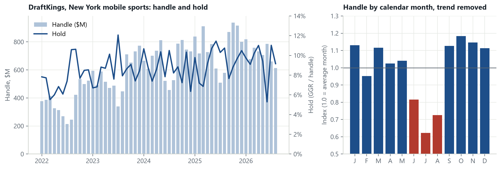

### 2.2 Simulated player-level data

No public dataset has sportsbook customers with acquisition channel, CAC, and promo cost, which is the core of customer economics. The one academic dataset of real bettors (the Transparency Project's bwin data) is licensed for non-commercial research only. So I simulated the player level, and used the real filings to calibrate it.

`simulate.py` generates 40,000 FTDs who signed up between September 2024 and August 2025 and records every day each one bet through June 2026, 1,563,923 player-days in total. Each FTD has:

- an acquisition channel (referral, TV and brand, search, affiliate, paid social), each with its own CAC
- a welcome offer (no-sweat first bet, deposit match, or bet $5 get $200), each with its own expected cost
- a state (nine, each with its tax rate)
- a hidden player type (bonus hunter, casual, regular, high value) that sets churn, betting frequency, stake size, odds preference, and how much of the welcome offer the player extracts

Channels and offers shift the mix of player types. That is the main assumption driving channel and offer results. The analysis never sees player type. It works only from behavior, as it would on real data. Type is used once, at the end, to check whether the models find the right players.

**What is calibrated to real data, and how close the simulation lands:**

| Measure | DraftKings NY (real) | Simulation |
|:---|---:|---:|
| Hold, Sep 2024 onward | 9.1% | 9.5% |
| Monthly hold, standard deviation | 1.64 pts | 1.55 pts |
| Seasonal pattern of activity | Index by calendar month (2.1) | Same index, used as input |
| New York tax rate | 51% of GGR | 51% |

Hold swings month to month because every customer bets on the same games, so outcomes are correlated. The simulation adds one shared shock per month, sized to the real standard deviation. Channel CACs, offer costs, player-type behavior, and the non-New York tax rates are my assumptions, all listed in `assumptions.toml`.

## 3. Data cleaning and transformation

### 3.1 Regulator filings

- Extracted the monthly rows from each page of the PDF with `pdfplumber` and a regular expression, then dropped the pre-launch months reported as $0.
- De-duplicated months that appear on more than one fiscal-year page.
- Computed hold as GGR divided by handle, and checked the state's share of GGR against the statutory 51% (it matches to three decimals every month).
- Removed market growth before measuring seasonality: each month's handle was divided by a centered 12-month moving average, and the ratios were averaged by calendar month and scaled to a mean of 1.

### 3.2 Player data

All transformation is in SQL (DuckDB), in `sql/01` through `sql/15`. The central table is a **player-month panel**: one row per FTD per 30-day "life month" since first deposit, 686,051 rows in all. Three decisions shape it:

- **Zero months are kept.** A month with no bets is a row with zeros, not a missing row. Averages are per FTD, not per active player, so retention and value are not overstated.
- **Right censoring is handled by truncation.** Each player is cut at their last fully observed month. Any 12-month figure uses only players with 12 full months, which is 36,457 of the 40,000 FTDs. Younger cohorts never pull a curve down.
- **Life months, not calendar months.** Month 1 is each player's first 30 days, so cohorts that signed up at different times are compared at the same age.

**Contribution** is the value measure throughout:

```
contribution = GGR - welcome promo - ongoing promos - tax x (GGR - promos) - 0.6% x handle
```

It is a contribution margin, not profit: it excludes fixed costs and overhead. Tax is applied to GGR net of promos as a simplification (section 8.3).

## 4. Exploratory data analysis

### 4.1 Where revenue goes

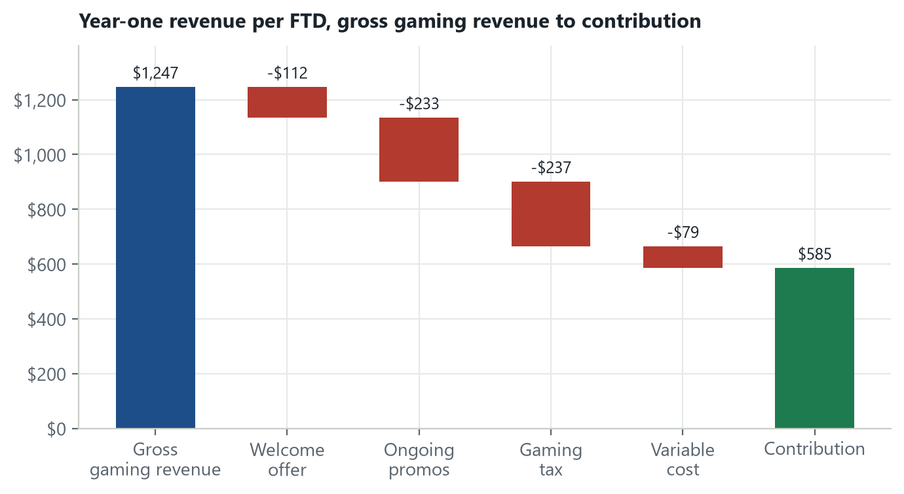

Of $1,247 in year-one GGR per FTD, promos take $345 (28%) and tax $237. Contribution is $585, 47% of GGR.

### 4.2 The distribution of player value

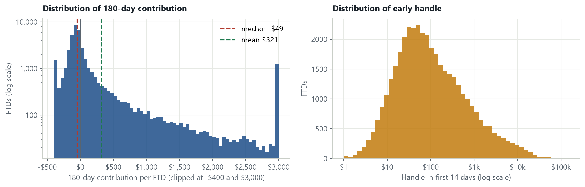

| Mean | Median | 10th pct | 25th pct | 75th pct | 90th pct | 99th pct | Skewness |
|---:|---:|---:|---:|---:|---:|---:|---:|
| $321 | -$49 | -$188 | -$110 | $72 | $675 | $8,311 | 18.3 |

180-day contribution is extremely right-skewed. The mean is $321 while the median is -$49, and 66% of FTDs are below zero, mostly because the welcome offer costs more than the book ever wins back from them. This shapes every later choice: averages are fragile, so channel results get bootstrap intervals, and model evaluation leans on rank-based metrics rather than squared error.

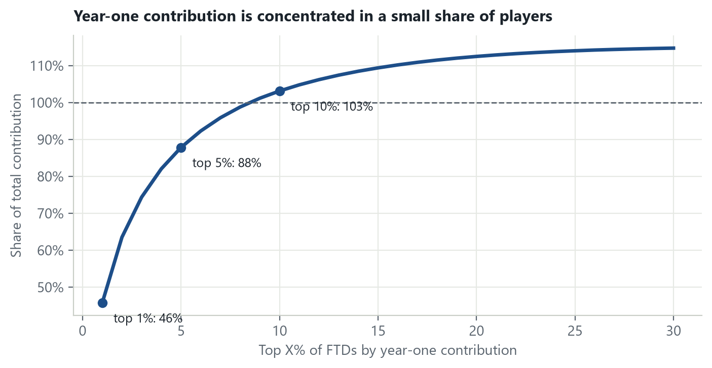

| Players | Share of year-one contribution | Average contribution |
|:---|---:|---:|
| Top 1% | 46% | $26,755 |
| Top 5% | 88% | $10,273 |
| Top 10% | 103% | $6,031 |
| Top 20% | 112% | $3,289 |

The top 9% of players account for all year-one contribution. The share passes 100% because the rest are net negative in aggregate.

### 4.3 Retention

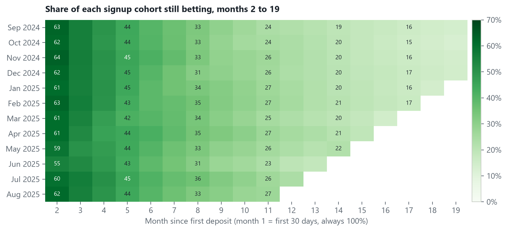

On average 39% of FTDs place no bet in their second month and 23% are still betting in month 12. Seasonality shows up in the second month: 64% of November 2024 signups bet again, against 55% of June 2025 signups, whose second month is July.

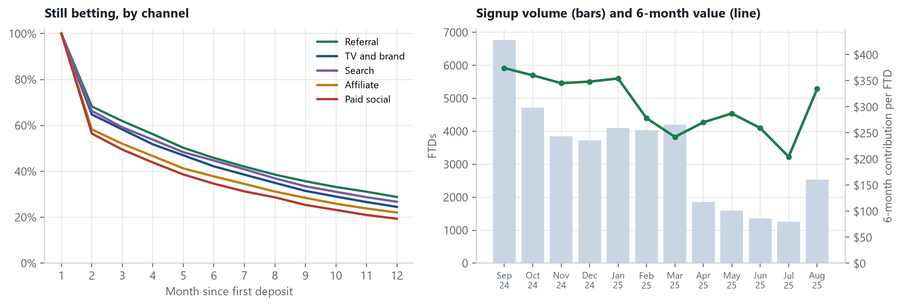

FTDs who sign up between September and January are worth $359 over six months, against $259 for February through July signups, whose early months overlap the summer lull.

### 4.4 Early behavior against later value

| Handle, days 0 to 13 | Share of FTDs | Avg active days | Active month 3 | Mean 180-day contribution | Share profitable | Share of total 180-day |
|:---|---:|---:|---:|---:|---:|---:|
| under $50 | 39.7% | 1.7 | 36% | -$74 | 8% | -9% |
| $50 to $250 | 30.9% | 2.6 | 54% | -$30 | 33% | -3% |
| $250 to $1k | 16.7% | 4.1 | 78% | $164 | 60% | 8% |
| $1k to $5k | 9.0% | 5.8 | 88% | $1,108 | 78% | 31% |
| $5k and up | 3.7% | 7.5 | 92% | $6,359 | 87% | 73% |

Early handle separates players sharply. The 3.7% of FTDs who stake $5,000 or more in their first two weeks produce 73% of 180-day contribution. This is the baseline any model has to beat.

## 5. Feature engineering

The prediction point is **day 14**: a model scores each FTD using only what is known by the end of their 14th day (days 0 to 13). Features are built in `sql/08_early_features.sql`.

**Targets**

- `active_m3`: whether the player bets at all in life month 3 (days 60 to 89). Binary, 55% positive.
- `contribution_180`: total contribution over days 0 to 179. It includes the first 14 days by design, because the business question is the player's total value. The model's real work is the remaining 166 days.

**Features**, with their rank correlation to each target

| Feature | Spearman with 180-day contribution | Spearman with active in month 3 |
|:---|---:|---:|
| Active days, days 0 to 13 | 0.30 | 0.35 |
| Active days, days 7 to 13 | 0.28 | 0.33 |
| Bets placed | 0.37 | 0.42 |
| Handle (total staked) | 0.40 | 0.40 |
| GGR (book's win) | 0.42 | 0.10 |
| Largest single-day handle | 0.40 | 0.37 |
| Average stake per bet | 0.34 | 0.27 |
| Days since last bet, at day 13 | -0.24 | -0.31 |
| Welcome offer cost | -0.24 | -0.02 |

- Categorical context: acquisition channel, welcome offer, state, and signup month (for seasonality).
- Week 2 activity and days idle are included because the *trend* of engagement matters: a player who bet heavily on day 1 and then stopped differs from one still betting on day 13.
- Largest single-day handle is included alongside total handle because a few large days signal a high-stakes player differently from many small ones.
- **Leakage check:** no feature uses anything after day 13, and nothing downstream of the outcome (such as churn date or lifetime) is available to the model.

Transformations depend on the model. For logistic regression, numeric features get a signed log transform, `sign(x) * log(1 + |x|)`, to tame the heavy tails (GGR can be negative), then standardization, and categoricals are one-hot encoded. Gradient boosting takes raw values and native categorical splits, since trees are invariant to monotone transforms.

## 6. Modeling choices

- **Out-of-time split.** Train on Sep 2024 to Apr 2025 signups (33,246 players), test on May 2025 to Aug 2025 (6,754). A random split would leak seasonal information across the boundary, and in practice the model is fit on past cohorts and used on new ones.
- **Baselines first.** Logistic regression for retention, and two naive rules for value: sort by 14-day handle, and predict the training mean.
- **Gradient boosting** (scikit-learn `HistGradientBoosting`) as the main model. It handles missing values, categoricals, and interactions without manual work, and is the standard strong baseline for tabular data. Early stopping on an internal validation split, learning rate 0.05.
- **Metrics chosen for the skew.** AUC for retention (ranking quality, insensitive to the threshold). For value, Spearman rank correlation and top-decile lift, because the business action is ranking players and a few whales dominate any squared-error metric. Mean absolute error is reported for completeness.
- **Permutation importance** on the test set, which measures how much accuracy drops when a feature is shuffled and is less biased toward high-cardinality features than split-based importance.
- **Bootstrap intervals** for channel LTV/CAC: 2,000 resamples of players within each channel, 95% percentile intervals. Given the skew in 4.2, point estimates alone would overstate precision.

## 7. Findings

### 7.1 Model performance

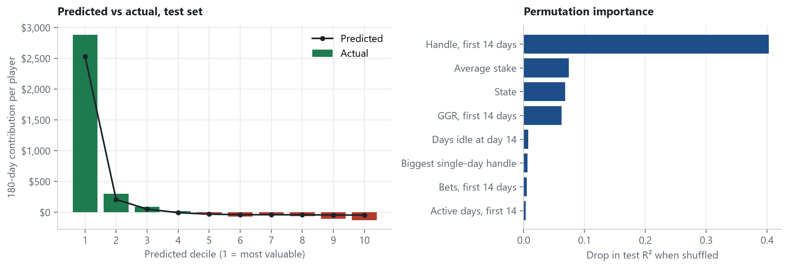

| Question | Metric | Gradient boosting | Baseline |
|:---|:---|---:|:---|
| Bets in month 3? | AUC | 0.753 | 0.755 (logistic regression) |
| Flag the at-risk decile | Share who lapse | 78% | 46% (all players) |
| Rank by 180-day value | Spearman | 0.519 | 0.367 (sort by 14-day handle) |
| Find the top decile | Lift over average | 10.17× | 10.07× (sort by 14-day handle) |
| Predict dollar value | Mean absolute error | $379 | $690 (predict the mean) |
| Find hidden high-value players | Share of top decile | 72% | 10% (base rate) |

- On retention, logistic regression matches gradient boosting (0.755 vs 0.753 AUC). The simpler model is the one to ship there.
- On value, gradient boosting ranks the whole base better than early handle alone (0.52 vs 0.37), but ties it on the top decile. Use the model for bids and retention spend across everyone, and a handle threshold for routing likely high-value players to VIP.
- The value model is biased low at the top: it predicts $2,529 for its top decile, which actually averages $2,884. Squared-error loss shrinks a heavy right tail. Modeling log value or recalibrating the top decile would fix it before anyone sets bids from it.
- 72% of the model's top decile are truly high-value players, against a 10% base rate, which confirms it is finding the right people rather than fitting noise.

### 7.2 Channel economics

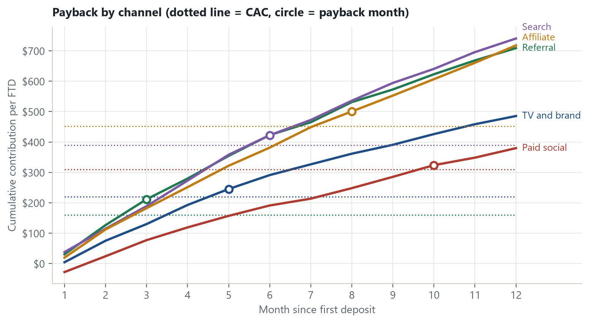

| Channel | FTDs | CAC | 12-mo LTV | Median LTV | LTV / CAC | 95% interval | Active month 3 | Payback |
|:---|---:|---:|---:|---:|---:|---:|---:|---:|
| Referral | 4,379 | $160 | $709 | -$27 | 4.42× | 3.70 to 5.26 | 62% | month 3 |
| TV and brand | 6,551 | $220 | $485 | -$36 | 2.21× | 1.91 to 2.56 | 58% | month 5 |
| Search | 7,287 | $390 | $740 | -$33 | 1.90× | 1.69 to 2.16 | 59% | month 6 |
| Affiliate | 8,101 | $452 | $718 | -$51 | 1.59× | 1.41 to 1.78 | 52% | month 8 |
| Paid social | 10,139 | $310 | $380 | -$53 | 1.23× | 1.05 to 1.42 | 50% | month 10 |

Every channel pays back inside a year, from month 3 for referral to month 10 for paid social, and every interval stays above 1.0×. The median FTD is net negative in every channel. Channels differ in how many high-value players they bring, not in how the typical player behaves.

### 7.3 Channel and offer

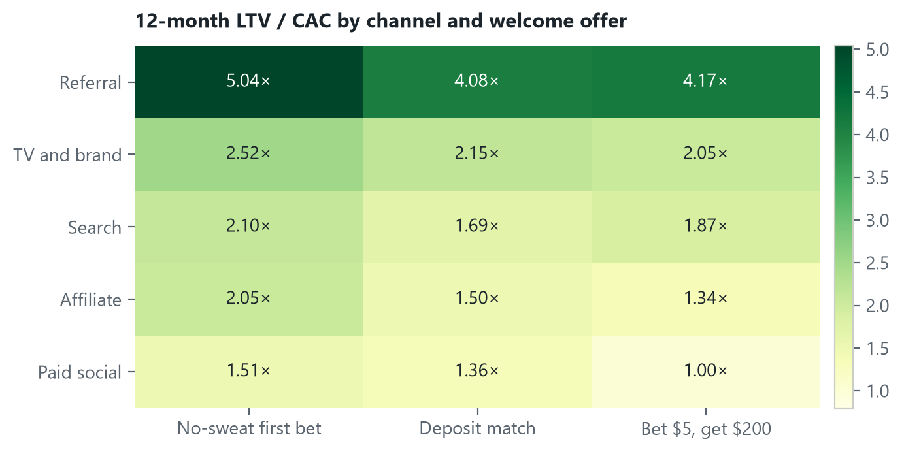

| Offer | FTDs | Offer cost per FTD | Active month 3 | 12-mo LTV | LTV / CAC |
|:---|---:|---:|---:|---:|---:|
| No-sweat first bet | 10,937 | $90 | 58% | $698 | 2.16× |
| Deposit match | 7,314 | $65 | 55% | $562 | 1.74× |
| Bet $5, get $200 | 18,206 | $144 | 53% | $527 | 1.63× |

The channel matters most, but within a channel the offer still moves the return: paid social goes from 1.00× with bet $5 get $200 to 1.51× with the no-sweat offer. The direction of this result is an assumption (I assumed the richest offer draws more bonus hunters). The size of the gap, net of offer cost, is the output.

### 7.4 State tax and bid caps

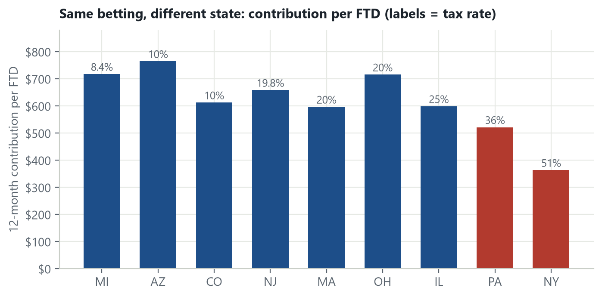

A New York FTD contributes $364 in year one at 51% tax, against $718 in Michigan at 8.4%. That gap is arithmetic, but it implies bid caps should be set by state. The table gives the highest CAC that still pays back inside 12 months for each channel and state. **Bold** marks cells where the channel's current CAC is above the cap. Cells hold roughly 300 to 1,600 FTDs, so small differences are noise.

| Channel | NY 51% | PA 36% | IL 25% | MA 20% | OH 20% | NJ 19.8% | AZ 10% | CO 10% | MI 8.4% |
|:---|---:|---:|---:|---:|---:|---:|---:|---:|---:|
| Referral (CAC $160) | $501 | $716 | $668 | $549 | $679 | $694 | $1,304 | $660 | $987 |
| TV and brand (CAC $220) | $261 | $379 | $622 | $328 | $755 | $638 | $549 | $440 | $595 |
| Search (CAC $390) | $498 | $640 | $706 | $914 | $786 | $989 | $984 | $592 | $861 |
| Affiliate (CAC $452) | **$426** | $655 | $773 | $771 | $889 | $528 | $1,137 | $860 | $898 |
| Paid social (CAC $310) | **$227** | $354 | $331 | $407 | $512 | $523 | **$258** | $506 | $454 |

## 8. Conclusion

### 8.1 Summary

An FTD in this simulation returns 1.81× its acquisition cost in year one, but that average hides extreme concentration: 46% of contribution comes from 1% of players and most players lose money after promos. The biggest levers are which channel a player comes from, which offer they receive, and which state they bet in. Two weeks of behavior is enough to rank players usefully, and a simple model on those two weeks ranks them better than early handle alone. Section 9 tests a pretrained tabular model, TabPFN, on the same problem.

### 8.2 Recommendations

1. Test the no-sweat offer against bet $5 get $200 in paid social, with a holdout, before changing that channel's budget.
2. Set acquisition bid caps by state (7.4) rather than one national CAC target.
3. Score every FTD at day 14. Use the value model for retention spend across the whole base, and a handle threshold to route likely high-value players to VIP.
4. Report channel LTV with an interval. With value this concentrated, a few players can move a channel's average.
5. Use logistic regression for retention scoring: it matches gradient boosting and is easier to explain.

### 8.3 Limitations

- Player-level data is simulated. Channel, offer, and player-type effects come from my assumptions, so conclusions about them demonstrate the method rather than describe real DraftKings economics.
- Only seasonality, hold, hold volatility, and New York's tax rate are calibrated to real data, and only from New York, the highest-tax state.
- Tax is a flat rate on GGR net of promos. Real states tier it, tax per wager, or limit promo deductions, and the non-New York rates are approximate.
- No casino or daily fantasy cross-sell, and churned players never return.

## 9. TabPFN: process and comparison

### 9.1 What TabPFN is

TabPFN (Hollmann et al., *Nature*, 2025) is a transformer pretrained by Prior Labs on millions of synthetic datasets drawn from a prior over how tabular data is generated: random causal structures, noise, missing values, and mixed types. It does not fit parameters to a new dataset. The labeled training rows go into the model as context, and it predicts the unlabeled rows in a single forward pass, in effect performing approximate Bayesian inference learned during pretraining. There is no hyperparameter tuning.

The practical claim is strong accuracy on small and medium tables, where there is not enough data to train and tune a model well. That is a common situation in customer economics: a new state launch, a new promotion, or a new product, with a few thousand players and a decision due before more data arrives.

### 9.2 Setup

- **Model version.** The open TabPFN v2 weights from Hugging Face (`Prior-Labs/TabPFN-v2-clf` and `-reg`), loaded through the `tabpfn` package. Newer versions (3.5) require an account and license acceptance for local use, so I used v2, which is ungated.
- **Same problem as section 6.** Same features, same targets, same out-of-time test set of 6,754 players, so results are directly comparable.
- **Context size.** 3,000 players sampled at random from the training cohorts. TabPFN v2 was pretrained on datasets up to about 10,000 rows, and inference cost grows with context size, so a smaller context kept the run feasible on a laptop CPU.
- **Encoding.** Categorical columns were integer-coded and flagged as categorical so TabPFN applies its own categorical handling. Numeric features were passed raw: TabPFN does its own preprocessing internally, including transforms suited to skewed data.
- **Ensembling.** 4 ensemble members, each with a different feature ordering and preprocessing, averaged.
- **CPU.** TabPFN refuses CPU runs above 1,000 rows by default because they are slow, so I set `ignore_pretraining_limits=True` and predicted in batches of 1,000. Scoring the test set took about 7 minutes for retention and 9 minutes for value.

To separate the effect of the model from the effect of less data, I compared three setups on the same test players: TabPFN on the 3,000-player sample, gradient boosting on the same 3,000, and gradient boosting on the full training set.

### 9.3 Results

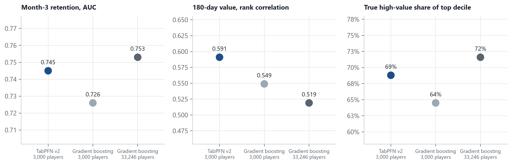

| Model | Retention AUC | Value Spearman | Value MAE | Top-decile lift | High-value share, top decile |
|:---|---:|---:|---:|---:|---:|
| TabPFN v2, 3,000 players | 0.745 | 0.591 | $368 | 10.25× | 69% |
| Gradient boosting, 3,000 players | 0.726 | 0.549 | $385 | 10.15× | 64% |
| Gradient boosting, 33,246 players | 0.753 | 0.519 | $379 | 10.17× | 72% |

### 9.4 Interpretation

- **At equal data**, TabPFN beats gradient boosting on retention by 0.019 AUC, and ranks 180-day value at 0.591 Spearman against 0.549.
- **Against 11× the data**, gradient boosting on 33,246 players: TabPFN is within 0.008 on retention AUC, and scores 0.591 against 0.519 on value ranking. On value ranking, the model with a tenth of the data is the best of the three.
- **Why value ranking goes this way.** Gradient boosting with squared-error loss spends its capacity fitting the few very large players, and its ranking of everyone else does not improve with more data (0.549 on 3,000 players, 0.519 on all of them). TabPFN predicts from a learned prior over tables rather than minimizing squared error on this one, which seems to make it less sensitive to the tail. Modeling log value with gradient boosting would be the fair next comparison.
- **Finding the top players.** Top-decile lift is nearly identical across all three (10.25×, 10.15×, 10.17×), and the full-data model recovers slightly more of the hidden high-value players (72% vs 69%). TabPFN's edge is in ranking the middle of the base.
- **Cost.** Gradient boosting trains and scores in seconds. TabPFN needed minutes per model on CPU, because every prediction attends over the whole context. At production scale it wants a GPU or Prior Labs' hosted API.
- **Where I'd use it.** First, small-sample questions where there is no time or data to tune a model: early reads on a new state, offer, or product. Second, as a benchmark. Its value-ranking result here says the full-data gradient boosting model is leaving accuracy on the table, and the next step would be to fix that model's loss rather than assume more data solves it.

TabPFN v2 weights are released under the Prior Labs License, which is Apache 2.0 with an attribution requirement. Built with TabPFN.

## 10. Reproducibility

```bash
python -m venv .venv
.venv/Scripts/pip install -r requirements.txt
.venv/Scripts/python run.py            # simulate, SQL, models, report (about 30 seconds)
.venv/Scripts/python model_tabpfn.py   # TabPFN comparison (about 15 to 20 minutes on CPU)
.venv/Scripts/python build_report.py   # rebuild this report with the TabPFN results
```

The pipeline is deterministic. One bug worth recording: results first changed between runs because DuckDB does not guarantee row order out of a parallel join, and row order decides which rows gradient boosting holds out for early stopping. Sorting the feature table fixed it.
